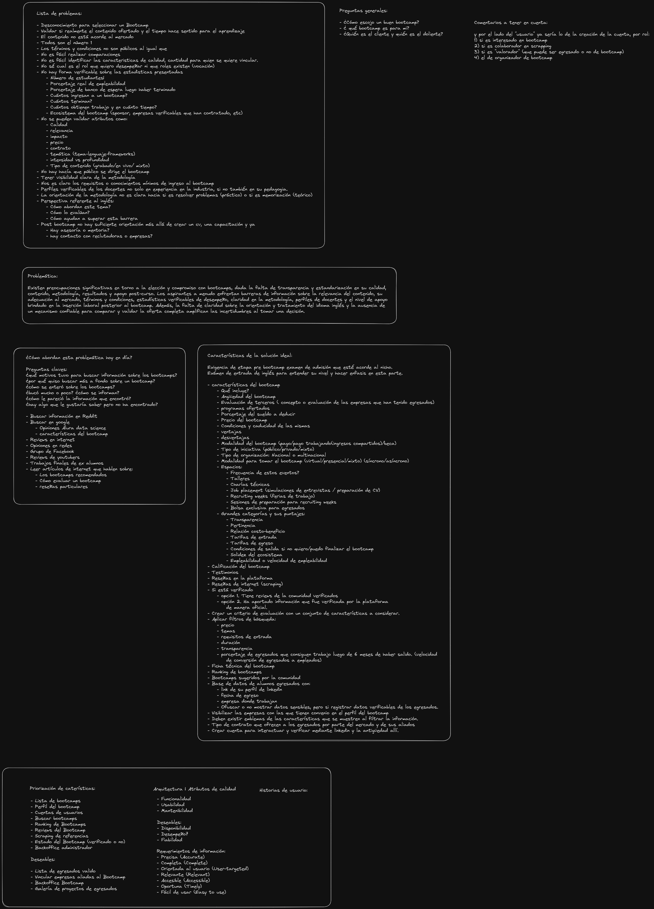

# Validador de Bootcamp

## Wiki

- [Wiki](https://github.com/Trycatch-tv/ValidadorBootcamp/wiki)
  
## Kanban

- [Kanban del proyecto](https://github.com/orgs/Trycatch-tv/projects/31)

## Repositorios

- [Backend](https://github.com/Trycatch-tv/ValidadorBootcamp-backend)
- [Frontend](https://github.com/Trycatch-tv/ValidadorBootcamp-frontend)

## Definiciones

